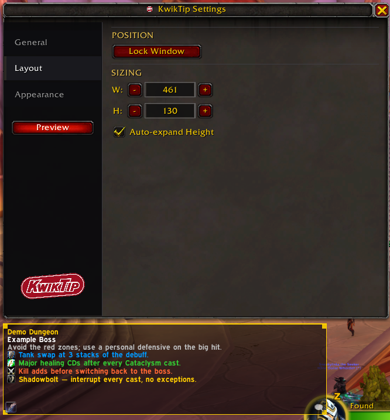
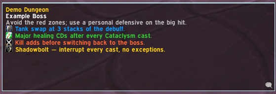
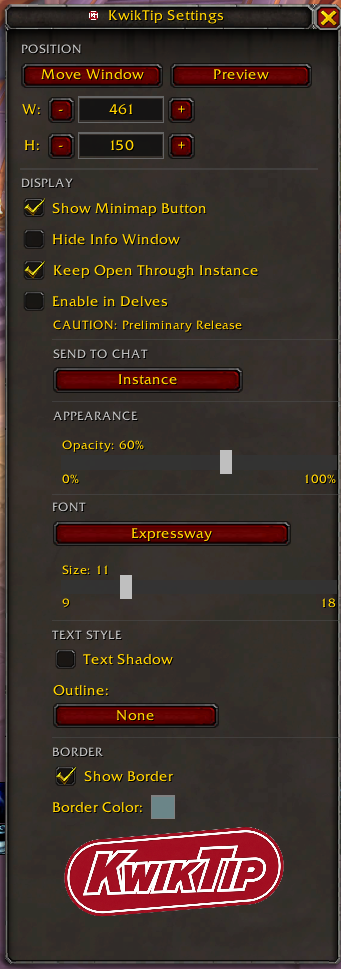

<p align="center">
  
</p>

<p align="center">
  World of Warcraft: Midnight — Patch 12.1 (Season 2)
</p>

A World of Warcraft: Midnight addon that displays contextual tips for dungeons, raids, delves, and Timewalking. As your group moves through an instance, KwikTip surfaces relevant boss and trash tips in a small, unobtrusive HUD — no interaction required mid-pull. **Day-one ready for Midnight Season 2.**

Inspired by **QE Dungeon Tips** by QEdev (no longer maintained).

**[Download on CurseForge](https://www.curseforge.com/wow/addons/kwiktip)** &nbsp;|&nbsp; **[Download on Wago](https://addons.wago.io/addons/kwiktip)** &nbsp;|&nbsp; **[Download on WoWInterface](https://www.wowinterface.com/downloads/info27074-KwikTip.html)**


---

## Screenshots

<p align="center">
  
</p>

<p align="center">
  
  &nbsp;&nbsp;
  
</p>

---

## Features

- **Boss tips** — concise, actionable guidance for every boss across dungeons, raids, delves, and Timewalking
- **Trash tips** — notable trash mobs in M+ dungeons get their own contextual tips with interrupt priorities and positioning notes
- **Sub-zone aware HUD** — the HUD updates automatically as your group moves through each area; boss room tips surface on entry before the encounter starts
- **Role-specific notes** — tips are categorized by role (tank, healer, DPS, general) and interrupt priority, each with a distinct color and icon
- **M+ affix display** — active keystone affix names and tips shown in the HUD between encounters
- **Raid support** — difficulty-aware tips for all Midnight raid wings, including the Season 2 raid (Venomous Abyss — opening Aug 18, 2026). Enabled by default; tips appear automatically inside raid instances
- **Delve support** — boss tips for all 13 Midnight delves (including 3 new Season 2 delves); opt-in via the **Enable in Delves** setting
- **Timewalking support** — all 35 dungeons registered across six expansion pools (Burning Crusade through Legion); tips being filled pool by pool
- **Custom notes** — save your own per-subzone notes that appear alongside tips in the HUD
- **Persistent Tip Window** — optionally keep the HUD visible throughout a run
- **Send to Chat** — print the current tip to Say, Instance, Party, or Raid
- **Resizable, draggable HUD** — drag to reposition, drag corners to resize; auto-expand height keeps long tips readable
- **LibSharedMedia-3.0 support** — font picker lists all fonts from your other addons; falls back to built-in WoW fonts
- **German (deDE) and Simplified Chinese (zhCN) localization** — UI, slash commands, HUD labels, and priority zhCN strategy content

---

## Dungeon Coverage

### Season 2 Mythic+ Rotation (Current — Patch 12.1, Aug 2026)

| Dungeon | Type | Status |
|---|---|---|
| Altar of Fangs | New — Midnight (3 bosses) | Boss + trash tips, verified |
| Murder Row | Promoted — Midnight | Boss + trash tips, verified |
| Den of Nalorakk | Promoted — Midnight | Boss + trash tips, verified |
| The Blinding Vale | Promoted — Midnight | Boss + trash tips, verified |
| Voidscar Arena | Promoted — Midnight | Boss tips ✓ (trash pending) |
| Kings' Rest | Legacy — Battle for Azeroth | Boss + trash tips |
| Temple of Sethraliss | Legacy — Battle for Azeroth | Boss + trash tips, verified |
| Ruby Life Pools | Legacy — Dragonflight | Boss + trash tips, verified |

All 8 dungeons have boss tips with role-specific notes. Trash tips are complete for 7/8. Six of eight dungeons have been cross-verified against the live method.gg Season 2 written guides; Voidscar Arena and Kings' Rest tips are sourced from Tactyks' YouTube S2 guides pending method.gg publication.

### Season 1 Mythic+ Rotation (Still Supported)

| Dungeon | Type |
|---|---|
| Windrunner Spire | Midnight |
| Maisara Caverns | Midnight |
| Magisters' Terrace | Midnight (reworked) |
| Nexus-Point Xenas | Midnight |
| Algeth'ar Academy | Legacy |
| Pit of Saron | Legacy |
| Seat of the Triumvirate | Legacy |
| Skyreach | Legacy |

Full boss + trash tips. All instance IDs confirmed in-game.

### Raids

| Raid Wing | Season | Notes |
|---|---|---|
| The Voidspire | S1 | 6 bosses — tips + role notes |
| March on Quel'Danas | S1 | uiMapID pending in-game verification |
| The Dreamrift | S1 | 1 boss — tips + role notes |
| **Venomous Abyss** | **S2** | **8 bosses — opening Aug 18, 2026. Boss tips in development.** |

### Delves

13 delves supported: 10 from Season 1 (boss tips for all), plus 3 new Season 2 delves on the Coiled Isle (The Ring of Glory, Gnarldor Isle, Venomfall Deeps — Nemesis). S2 delve boss tips are in development. **Opt-in** via the **Enable in Delves** setting.

### Timewalking

35 dungeons registered across six expansion pools: Burning Crusade, Wrath of the Lich King, Cataclysm, Mists of Pandaria, Warlords of Draenor, and Legion. Boss tips are being added pool by pool from Wowhead (primary) and warcraft.wiki.gg (secondary). To help fill out a dungeon, verify its `uiMapID` in-game with `/run print(C_Map.GetBestMapForUnit("player"))` and open a tip-suggestion issue.

---

## Known Limitations

This is a **semi-ready** Season 2 release. Everything below works and ships in v3.0.1, but some content is still being completed for the Aug 18 S2 launch:

- **4 S2 dungeon IDs are unverified** — Kings' Rest, Temple of Sethraliss, Ruby Life Pools, and Altar of Fangs still have `instanceID = 0` / `uiMapID = 0`. These will auto-fill from the in-game debug log once run with `/kwik debuglog` and `tools/sync_ids.py --apply`. Until then, detection for these dungeons falls back to `uiMapID` lookup (which is also 0 for the same four).
- **Venomous Abyss raid** — 8-boss skeleton present, but individual boss names and tips are TODO (the raid opens Aug 18; guides are expected to publish at launch).
- **Voidscar Arena and Kings' Rest** — tips are sourced from Tactyks' YouTube S2 previews; the written method.gg guides have not yet published (HTTP 404 as of Aug 11). Tips will be cross-verified when the guides go live.
- **3 new Season 2 delves** — registered as stubs with `instanceID = 0` / `uiMapID = 0`; boss names and tips are TODO pending S2 delve guide publication.
- **Timewalking boss tips** — incomplete across most pools; contributions welcome.

The addon uses a daily cron monitor that watches method.gg and Icy Veins dungeon guide pages for changes. When new guides publish, the monitor auto-flags them for cross-verification — so gaps close automatically as source material appears.

---

## Installation

1. Download or clone this repository
2. Copy the `KwikTip` folder into your addons directory:
   ```
   World of Warcraft/_retail_/Interface/AddOns/KwikTip
   ```
3. Enable the addon in the WoW character select screen

---

## Usage

| Command | Action |
|---|---|
| `/kwiktip` or `/kwik` | Open/close settings |
| `/kwik move` | Toggle move mode (drag and resize the HUD) |
| `/kwik debug` | Print current instance detection state to chat |
| `/kwik debuglog` | Toggle map/mob ID logging to SavedVariables |
| `/kwik preview` | Toggle role notes preview in the HUD |
| `/kwik clearlog` | Clear all debug logs from SavedVariables |
| `/kwik feedback` | Print the feedback/issue link to chat |
| `/kwik help` | Print all available commands to chat |

The HUD is hidden outside of instances. Use `/kwik move` to show and reposition it at any time.

### Settings

Open the settings window (minimap button or `/kwik`) to configure:

- **Persistent Tip Window** — keep the HUD visible between subzone changes during a run
- **Enable Custom Notes** — show the per-subzone note button so you can save personal notes
- **Enable in Delves** — opt in to tips inside Delve (scenario) instances
- **Hide HUD** — quickly hide the addon without disabling it; toggle again to show
- **Auto-expand Height** — let the HUD grow for long tips instead of clipping
- **Send to Chat** — choose None / Say / Instance / Party / Raid to print the current tip
- **Font** — pick from LibSharedMedia-3.0 fonts (falls back to built-in WoW fonts)
- **Preview** — see how role notes render without entering an instance

A minimap button (when enabled) provides quick access: left-click opens settings, right-click toggles move mode, drag to reposition.

---

## Translations

The settings UI, slash help, and HUD labels are fully localizable. **German (deDE)** and **Simplified Chinese (zhCN)** are bundled. The zhCN edition also includes reviewed Chinese strategy text for the current Season 2 Mythic+ rotation and Magisters' Terrace; uncovered encounters continue to fall back to upstream English.

The zhCN localization is maintained in the [Aruke05/KwikTip fork](https://github.com/Aruke05/KwikTip). 中文界面包括设置、斜杠命令、HUD 标签、悬浮提示及调试消息；攻略正文使用稳定的首领和区域 ID 覆盖，并在缺少已校对翻译时自动回退到上游英文。

To contribute a translation for your language:

1. Log in to CurseForge
2. Go to the [KwikTip localization page](https://legacy.curseforge.com/wow/addons/kwiktip/localization)
3. Select your language and fill in the strings

Translations are pulled automatically into each release via the CurseForge packager.

---

## Feedback & Tips

Tips feel off or missing? File an issue: https://github.com/postblink/KwikTip/issues

There are templates for bug reports and tip suggestions — the tip-suggestion template is the fastest way to get a correction or addition into the next release.
